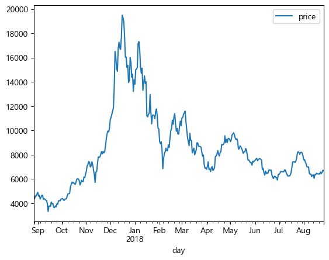
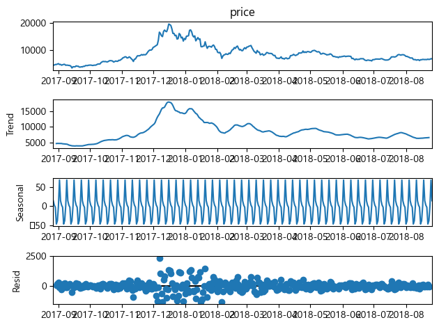
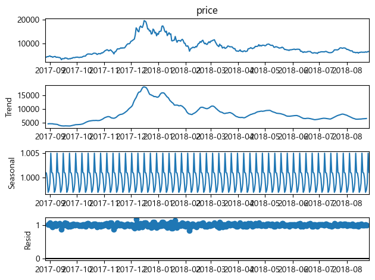

# 시계열 데이터 불러오기


```python
import pandas as pd

df = pd.read_csv("csv/market-price.csv",names = ['day', 'price'])
print(df.info(), df)
```

    <class 'pandas.core.frame.DataFrame'>
    RangeIndex: 365 entries, 0 to 364
    Data columns (total 2 columns):
     #   Column  Non-Null Count  Dtype  
    ---  ------  --------------  -----  
     0   day     365 non-null    object 
     1   price   365 non-null    float64
    dtypes: float64(1), object(1)
    memory usage: 5.8+ KB
    None                      day        price
    0    2017-08-27 00:00:00  4354.308333
    1    2017-08-28 00:00:00  4391.673517
    2    2017-08-29 00:00:00  4607.985450
    3    2017-08-30 00:00:00  4594.987850
    4    2017-08-31 00:00:00  4748.255000
    ..                   ...          ...
    360  2018-08-22 00:00:00  6575.229167
    361  2018-08-23 00:00:00  6434.881667
    362  2018-08-24 00:00:00  6543.645714
    363  2018-08-25 00:00:00  6719.429231
    364  2018-08-26 00:00:00  6673.274167
    
    [365 rows x 2 columns]
    

day가 1일 단위로 나뉘어 있는 모습을 확인할 수 있다. 해당 데이터의 타입을 object타입에서 시계열 단위로 바꿔주고 이 열을 인덱스로 사용해본다.


```python
df["day"] = pd.to_datetime(df["day"])
print(df.info())
df.set_index('day', inplace=True)
print(df.info(), df)
```

    <class 'pandas.core.frame.DataFrame'>
    RangeIndex: 365 entries, 0 to 364
    Data columns (total 2 columns):
     #   Column  Non-Null Count  Dtype         
    ---  ------  --------------  -----         
     0   day     365 non-null    datetime64[ns]
     1   price   365 non-null    float64       
    dtypes: datetime64[ns](1), float64(1)
    memory usage: 5.8 KB
    None
    <class 'pandas.core.frame.DataFrame'>
    DatetimeIndex: 365 entries, 2017-08-27 to 2018-08-26
    Data columns (total 1 columns):
     #   Column  Non-Null Count  Dtype  
    ---  ------  --------------  -----  
     0   price   365 non-null    float64
    dtypes: float64(1)
    memory usage: 5.7 KB
    None                   price
    day                    
    2017-08-27  4354.308333
    2017-08-28  4391.673517
    2017-08-29  4607.985450
    2017-08-30  4594.987850
    2017-08-31  4748.255000
    ...                 ...
    2018-08-22  6575.229167
    2018-08-23  6434.881667
    2018-08-24  6543.645714
    2018-08-25  6719.429231
    2018-08-26  6673.274167
    
    [365 rows x 1 columns]
    

그래프로 그려서 확인해보기


```python
import matplotlib.pyplot as plt

df.plot()
plt.show()
```


    

    


# 시계열 분해하기


```python
import statsmodels.api as sm
```

- 가법 모델로 분해하기


```python
result = sm.tsa.seasonal_decompose(df["price"], model = "additive")
result.plot()
plt.show()
```

    C:\anaconda\envs\da\lib\site-packages\statsmodels\tsa\seasonal.py:338: UserWarning: Glyph 8722 (\N{MINUS SIGN}) missing from current font.
      fig.tight_layout()
    C:\anaconda\envs\da\lib\site-packages\IPython\core\pylabtools.py:151: UserWarning: Glyph 8722 (\N{MINUS SIGN}) missing from current font.
      fig.canvas.print_figure(bytes_io, **kw)
    


    

    


```python
result.trend
```


    day
    2017-08-27            NaN
    2017-08-28            NaN
    2017-08-29            NaN
    2017-08-30    4598.476807
    2017-08-31    4640.455614
                     ...     
    2018-08-22    6501.864919
    2018-08-23    6540.323609
    2018-08-24            NaN
    2018-08-25            NaN
    2018-08-26            NaN
    Name: trend, Length: 365, dtype: float64


```python
result.seasonal
```


    day
    2017-08-27    14.573619
    2017-08-28     3.012504
    2017-08-29    -2.687809
    2017-08-30   -46.671846
    2017-08-31   -37.974864
                    ...    
    2018-08-22   -46.671846
    2018-08-23   -37.974864
    2018-08-24     0.967942
    2018-08-25    68.780454
    2018-08-26    14.573619
    Name: seasonal, Length: 365, dtype: float64


- 승법 모델로 분해하기


```python
result2 = sm.tsa.seasonal_decompose(df["price"], model = "multiplicative")
result2.plot()
plt.show()
```


    

    


```python
result2.trend
```


    day
    2017-08-27            NaN
    2017-08-28            NaN
    2017-08-29            NaN
    2017-08-30    4598.476807
    2017-08-31    4640.455614
                     ...     
    2018-08-22    6501.864919
    2018-08-23    6540.323609
    2018-08-24            NaN
    2018-08-25            NaN
    2018-08-26            NaN
    Name: trend, Length: 365, dtype: float64


```python
result2.seasonal
```


    day
    2017-08-27    1.001050
    2017-08-28    1.000922
    2017-08-29    0.999722
    2017-08-30    0.996989
    2017-08-31    0.997452
                    ...   
    2018-08-22    0.996989
    2018-08-23    0.997452
    2018-08-24    0.998866
    2018-08-25    1.005001
    2018-08-26    1.001050
    Name: seasonal, Length: 365, dtype: float64
